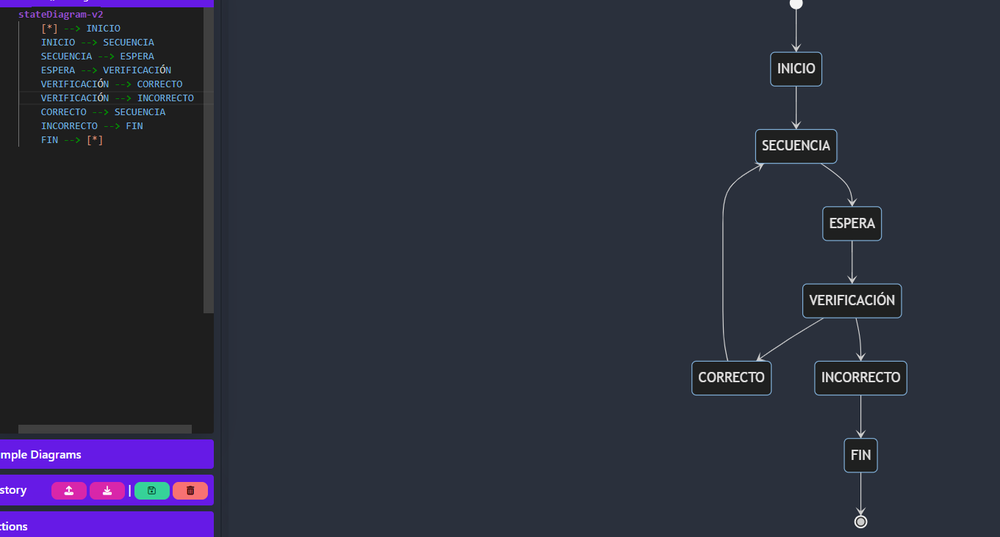
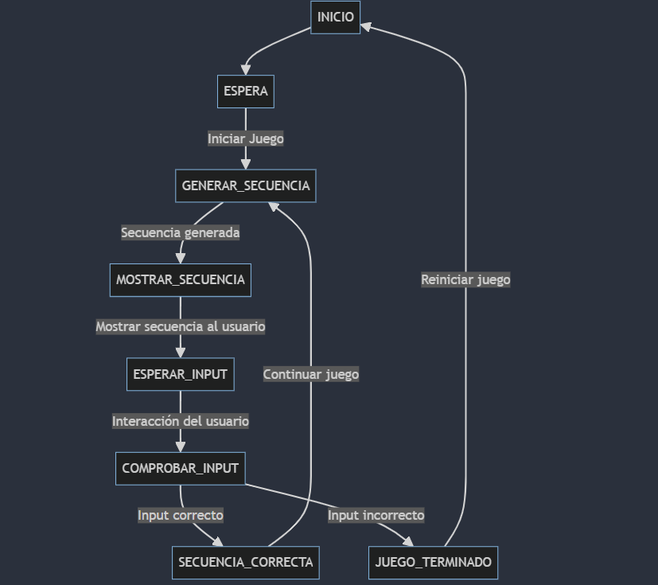
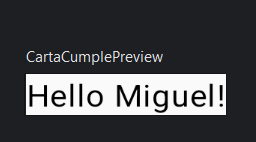
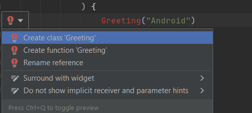
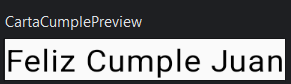
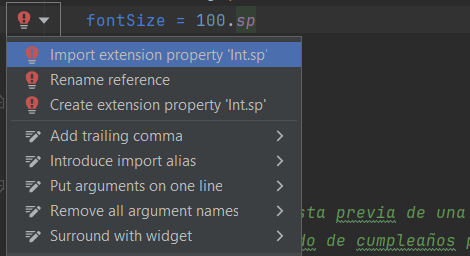
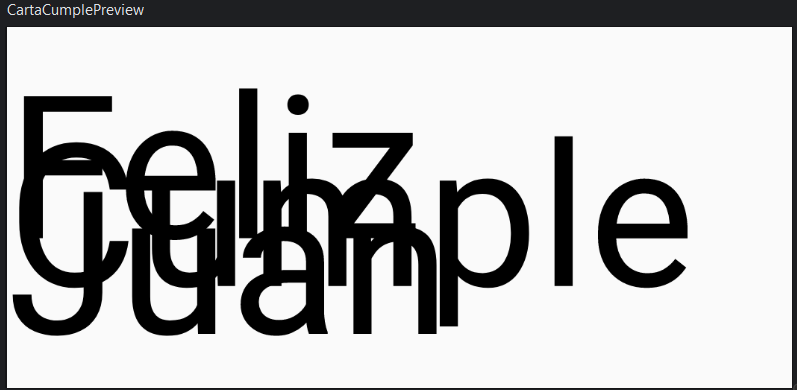
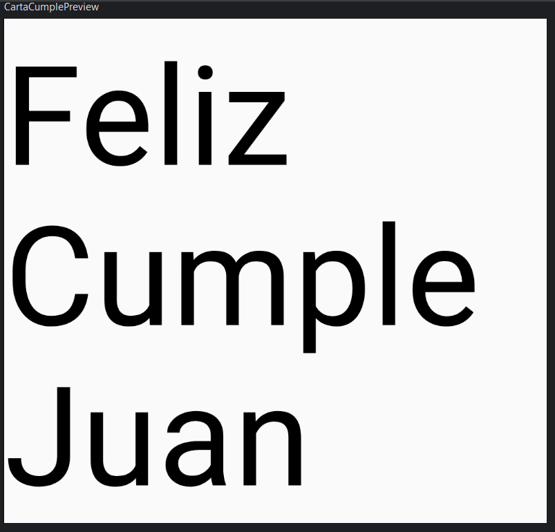
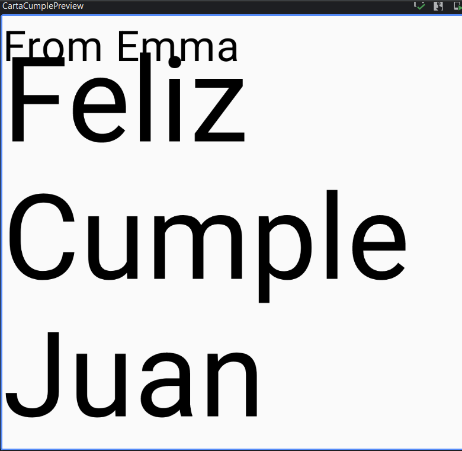

## App de feliz cumpleaños (tutorial)

Esta sera una app para Android que muestra un saludo de cumpleaños en formato de texto, que, una vez creada, se verá
como esta captura de pantalla. Desde el código base al crear un nuevo proyecto en AndroidStudio. Este es el código que
modificaremos para realizar la app.


```kotlin

class MainActivity : ComponentActivity() {
    override fun onCreate(savedInstanceState: Bundle?) {
        super.onCreate(savedInstanceState)
        setContent {
            FelizCumpleTheme {
                // A surface container using the 'background' color from the theme
                Surface(
                    modifier = Modifier.fillMaxSize(),
                    color = MaterialTheme.colorScheme.background
                ) {
                    Greeting("Android")
                }
            }
        }
    }
}


@Composable
fun Greeting(name: String, modifier: Modifier = Modifier) {
    Text(
        text = "Hello $name!",
        modifier = modifier
    )
}

@Preview(showBackground = true)
@Composable
fun GreetingPreview() {
    FelizCumpleTheme {
        Greeting("Android")
    }
}
````
**Sugerencia** usar en la parte de arriba a la derecha la opción de split dado que desde ahí iremos viendo como avanza
el proyecto.



Así es el proyecto en zona de split en la ventana de la derecha para como es al inicio:



### Primeros cambios:

En esta parte del código:

```kotlin
@Preview(showBackground = true)
@Composable
fun GreetingPreview() {
    FelizCumpleTheme {
        Greeting("Android")
    }
}
```

Cambiaremos el nombre de la función a uno acorde a nuestro nombre del proyecto en mi caso a CartaCumple y en el apartado
de `Greeeting` lo de dentro de parentesis a tu nombre y se quedaría así:

```kotlin
@Preview(showBackground = true)
@Composable
fun CartaCumplePreview() {
    FelizCumpleTheme {
        Greeting("Miguel")
    }
}
```

Resultado al realizar el cambio en la parte de la ventana de la derecha del diseño Split anteriormente comentado:



### Nuevo elemento de texto
El siguiente cambio que haremos sera para agregar un nuevo elemento de texto para crear un saludo de cumpleaños.

Empezaremos quitando el siguiente código:

```kotlin
@Composable
fun Greeting(name: String, modifier: Modifier = Modifier) {
    Text(
        text = "Hello $name!",
        modifier = modifier
    )
}
```

Y ahora al quitar esa función procederemos a quitar los errores. En la función `onCreate()` se llama a esta función
donde también lo eliminaremos. Este es el error de la función `onCreate()`:



Y también dará error en la función de `CartaCumplePreview()` con el mismo error y también eliminaremos donde se llama
a la función eliminada. Quedará tu archivo de `MainActivity.kt` similar a este código:

```kotlin
class MainActivity : ComponentActivity() {
    override fun onCreate(savedInstanceState: Bundle?) {
        super.onCreate(savedInstanceState)
        setContent {
            FelizCumpleTheme {
                // A surface container using the 'background' color from the theme
                Surface(
                    modifier = Modifier.fillMaxSize(),
                    color = MaterialTheme.colorScheme.background
                ) {
                }
            }
        }
    }
}


/**
 * Esta función define una vista previa de una tarjeta de cumpleaños personalizada.
 * La tarjeta muestra un saludo de cumpleaños para un destinatario específico en este caso Miguel.
 */
@Preview(showBackground = true)
@Composable
fun CartaCumplePreview() {
    FelizCumpleTheme {
    }
}
```

Para añadir el elemento de texto encima de la función `CartaCumplePreview()`, agregaremos una nueva función llamada
`GreetingText()`. Importante agrega también el `@Composable` antes de la función, ya que esta función de Compose será
un elemento componible `Text`. Así seria como estaría el código agregado:

```kotlin 
@Composable
fun GreetingText() {
}
```

Seguiremos añadiendo al elemento componible entre los parentesis un parámetro `Modifier` y pase ese `modifier`  a su
primer elemento secundario.

```kotlin 
@Composable
fun GreetingText(modifier: Modifier = Modifier) {
}
```

Procederemos al mensage agregando un parámetro `message` de tipo `String` a esta misma función.

```kotlin
@Composable
fun GreetingText(message: String, modifier: Modifier = Modifier) {
}
```

Seguiremos con la misma función agregando un elemento `Text` componible para que pase el mensaje  de texto como un
argumento con nombre.

```kotlin
@Composable
fun GreetingText(message: String, modifier: Modifier = Modifier) {
    Text(
        text = message
    )
}
```

Para ver una vista previa de la función `GreetingText()` en el panel Split en la ventana derecha.

- Llamaremos a la función de `GreetingText()` dentro de la función de `CartaCumplePreview()`. Seguiremos añadiendo entre
  los parentesis un argumento tipo `String`, seria el mensaje de cumpleaños para tu amigo quedaria asi el código de
  `CartaCumplePreview()`:

```kotlin
@Preview(showBackground = true)
@Composable
fun CartaCumplePreview() {
    FelizCumpleTheme {
        GreetingText(message = "Feliz Cumple Juan")
    }
}
```

Resultado en la ventana de la derecha del panel de Split:



### Cambio del tamaño de la fuente

A partir de ahora iremos algo más rápidos, seguiremos con el tamaño de la fuente del mensaje para esto debemos saber
que son los pixeles escalables.

<details>
  <summary><b>¿Qué son los pixeles escalables (sp)?</b></summary>

Los "pixeles escalables" (sp) son una unidad de medida en Android utilizada principalmente para definir tamaños de texto
y otros elementos de interfaz de usuario que deben adaptarse al tamaño de fuente preferido del usuario. A diferencia de
los píxeles densidad independiente (dp), los sp tienen en cuenta la configuración de tamaño de fuente del dispositivo,
ajustando automáticamente su tamaño para mantener la legibilidad y la coherencia visual. Esto es especialmente útil para
asegurar una experiencia de usuario consistente en diferentes dispositivos y configuraciones de accesibilidad,
proporcionando un diseño adaptable y accesible en aplicaciones Android.

</details>

Una vez sabiendo esto nos moveremos a la función de `GreetingText()` en el elemento componible `Text`, donde agregaremos
un argumento `fontSize` y coomo segundo argumento en mi ejemplo pondremos el valor de `100.sp`. Aquí tendremos que
importar `androidx.compose.ui.unit.sp` para que non aparezca o siguiente error:



Resultado en el panel Split en la ventana de la derecha:



Dada la superposición de las palabras tendremos que actualizar el elemento `Text` componible de modo que incluya la
altura de la línea con `lineHeight` donde en mi caso le pondre el valor de `116.sp`. Así seria el código en mi caso:

```kotlin
@Composable
fun GreetingText(message: String, modifier: Modifier = Modifier) {
    Text(
        text = message,
        fontSize = 100.sp,
        lineHeight = 116.sp

    )
}
```

Y se veria así en la vista previa:


### Otro nuevo elemento de texto

Con este nuevo elemento buscaremos para la carta de cumpleaños poner el nombre de quien envia la carta de felicitaciones.
Comenzaremos llendo a la función de `GreetingText()` y entre los parentesis de la función meteremos un parámetro `from`
de tipo `String`. Así seria

```php
fun GreetingText(message: String, from: String, modifier: Modifier = Modifier)
```

En la misma función agregaremos otro elemento componible de tipo `Text` que acepte un argumento `text` con el valor de
`from` y le pones un argumento de fontSize cun valor en mi caso de `30.sp`. Así seria el código:

```php
@Composable
fun GreetingText(message: String, from: String, modifier: Modifier = Modifier) {
    Text(
        text = message,
        fontSize = 100.sp,
        lineHeight = 116.sp

    )
    Text(
        text = from,
        fontSize = 30.sp
    )
}
```

Para acabar de agregarlo nos desplazaremos a la función de `CartaCumplePreview()`, en esta función agregaremos un nuevo
argumento String para firmar la tarjeta en mi caso lo firmare así `De Miguel`. El código sería asi desta función:

```php
@Preview(showBackground = true)
@Composable
fun CartaCumplePreview() {
    FelizCumpleTheme {
        GreetingText(message = "Feliz Cumple Juan", from ="De Miguel")
    }
}
```

Así seria el resultado de la vista previa:



### Como organizar los elementos de texto en una fila y columna

#### Jerarquía de la Ui

La jerarquía de la interfaz de usuario en Jetpack Compose se basa en la composición de componentes, donde un componente
puede contener uno o más componentes dentro de él. Esta organización se refleja en una estructura jerárquica de elementos
visuales. Algunos términos comunes son "padre" (superior) e "hijo" (secundario), donde un elemento superior contiene uno
o más elementos secundarios, que a su vez pueden contener más elementos secundarios. En esta sección, exploraremos los
componentes componibles Column, Row y Box, que actúan como elementos superiores en la jerarquía de la interfaz de usuario.

##### Column, Row y Box en Compose
Los elementos Column, Row y Box son funciones componibles básicas en Jetpack Compose utilizadas para organizar y
estructurar la interfaz de usuario. Aquí está cómo se usan:

- Column: Organiza los elementos de forma vertical, uno debajo del otro.
- Row: Organiza los elementos de forma horizontal, uno al lado del otro.
- Box: Ofrece flexibilidad para posicionar y ajustar elementos de forma personalizada.

Estos elementos componibles toman otros componentes (como Text, Image, etc.) como argumentos, permitiéndote colocar y
organizar elementos dentro de ellos para construir interfaces de usuario complejas y dinámicas.

```php
// Ejemplo de uso de Row en Jetpack Compose
Row {
    Text("Primera fila")
    Text("Segunda fila")
}

```
En este ejemplo, los dos componentes Text se colocan uno al lado del otro en una fila horizontal.

#### Sintaxis de Expresión Lambda en Jetpack Compose
En Jetpack Compose, la sintaxis de expresión lambda final se utiliza comúnmente para definir comportamientos o
configuraciones dentro de funciones componibles. Esta sintaxis simplifica la escritura y hace que el código sea más
conciso. Por ejemplo, en el uso de la función Row:

```php
Row {
    Text("Elemento 1")
    Text("Elemento 2")
}

```

Aquí, la expresión lambda se utiliza para describir los elementos secundarios (Text) que deben colocarse dentro de la
fila (Row). La ausencia de paréntesis y el uso directo de llaves { } alrededor de los elementos secundarios es un
ejemplo de la sintaxis de expresión lambda final en Jetpack Compose.

La sintaxis de expresión lambda final es una característica importante en Jetpack Compose que permite una composición
más fluida y legible de interfaces de usuario mediante la configuración de comportamientos y estructuras de forma declarativa.


